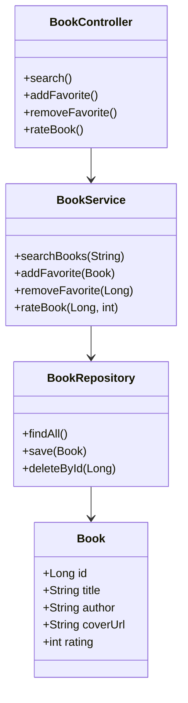

# BookAdvisor 📚

A Java + Spring Boot app that lets you search for books via [Open Library](https://openlibrary.org/developers/api) and save them as favorites.

## Main Features
- 🔍 Search for books by title, author, or publication date
- ⭐ View cover, author, title, details and add to favorites
- 🗑️ Remove single or all favorites
- 🌟 Rate books from 1 to 5 stars
- 🌐 API documentation with Swagger

## Technologies Used

- **Java 17**: Provides a modern, robust, and type-safe language for backend development.
- **Spring Boot**: Simplifies the setup and development of stand-alone, production-grade Spring applications.
- **Maven**: Manages project dependencies and build lifecycle.
- **Open Library API**: Supplies book data for search and display.
- **Swagger (Springfox)**: Generates interactive API documentation for easy testing and exploration.
- **H2 Database**: Offers an in-memory database for fast development and testing.
- **Thymeleaf**: Enables dynamic rendering of HTML pages for the web interface.

## Design Patterns & Architecture

- **MVC (Model-View-Controller)**: Separates concerns between data (Model), user interface (View), and business logic (Controller), making the application maintainable and scalable.
- **Repository Pattern**: Abstracts data access, allowing easy swapping of data sources and promoting testability.
- **Service Layer Pattern**: Encapsulates business logic, keeping controllers thin and focused on handling HTTP requests.
- **DTO (Data Transfer Object) Pattern**: Transfers data between layers, improving security and decoupling internal models from external representations.

*These technologies and patterns were chosen to ensure the application is modular, testable, and easy to maintain, while leveraging industry standards for Java web development.*

## Setup & Execution

1. **Clone the repository:**
    ```bash
    git clone <repository-url>
    cd OOPEXAM
    ```

2. **Build and run the application:**
    ```bash
    mvn clean install
    mvn spring-boot:run
    ```

3. **Access the application:**
    - Web Interface → [http://localhost:8080](http://localhost:8080)
    - Swagger API → [http://localhost:8080/swagger-ui.html](http://localhost:8080/swagger-ui.html)

## UML Diagrams

### Class Diagram



### Architectural Diagram

```mermaid
flowchart TD
     UI[Web UI (Thymeleaf)] -->|HTTP| Controller[Spring MVC Controller]
     Controller -->|Service Calls| Service[Service Layer]
     Service -->|Data Access| Repository[Repository Layer]
     Repository -->|Persistence| DB[(H2 Database)]
     Service -->|API Calls| OpenLibrary[Open Library API]
```

## Known Limitations

- Only supports the Open Library API; no support for other book APIs.
- No user authentication or multi-user support.
- Favorites and ratings are stored in-memory (H2); data is lost on restart.
- Limited error handling for external API failures.
- UI is basic and not optimized for mobile devices.

## Future Work

- Add user authentication and profiles.
- Persist data in a production-ready database (e.g., PostgreSQL).
- Enhance UI/UX and add mobile responsiveness.
- Support additional book APIs and advanced search filters.
- Implement pagination and sorting for search results.
- Add integration and unit tests for improved reliability.
- Deploy to cloud platforms for public access.

